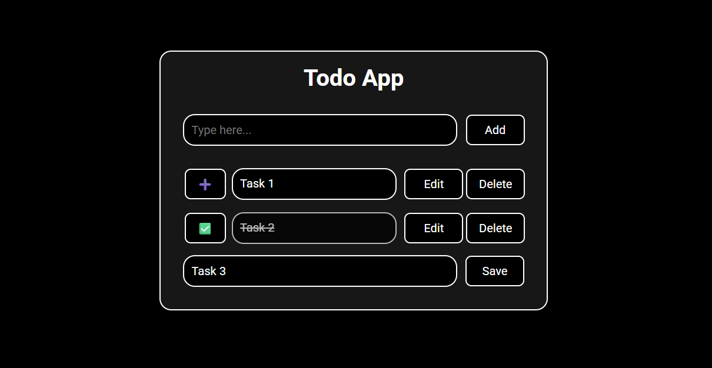

# Todo App

My first JavaScript project built completely from scratch — no tutorials used.

This project took around 5 days of work (3–4 hours daily) and involved a lot of debugging, experimentation, and learning how real applications manage data and UI.

Since this is my first complete JavaScript project, I felt it deserved its own repository.

This is **Version 2** of the project.

### Live Preview

https://panwarcodes.github.io/Todo-App

## Change Log

- Rewrote the entire `script.js` with a cleaner structure
- Refactored repeated logic into reusable functions
- Switched to an array-based LocalStorage system
- Preserved task order after page refresh
- Improved UI rendering without requiring page reloads
- Simplified task editing and deletion logic

## Features

* Add tasks
* Edit tasks
* Delete tasks
* Persistent storage using LocalStorage
* Automatic task loading on page refresh
* Real-time UI updates without page reloads
* Form validation for empty tasks

## What I Learned

* DOM manipulation
* Event listeners
* Forms and inputs
* Dynamic element creation
* LocalStorage and JSON
* Array methods
* State management basics
* UI rendering and re-rendering
* Debugging complex JavaScript bugs
* Separating application data from UI

## Challenges Faced

* Rendering duplicate tasks
* Keeping LocalStorage and UI synchronized
* Managing dynamic event listeners
* Preserving task order after refresh
* Editing and deleting dynamically created elements

## Future Improvements

* [x] Fix task order after page refresh
* [ ] Task completion / checkbox support
* [ ] Mobile responsiveness improvements

---

More projects coming soon in my playground repository.
